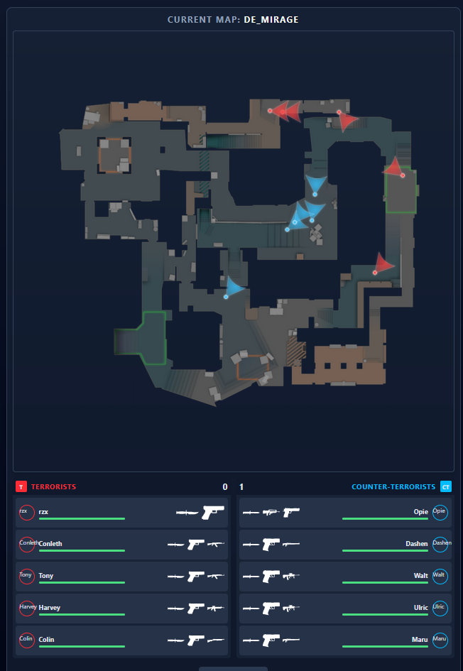
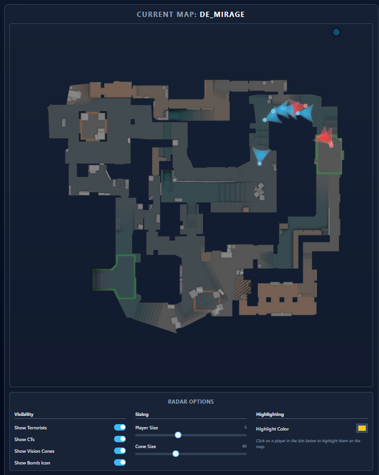

# WRadar | A CS2 Webradar
WRadar is a small side project of mine. Yes the frontend is a endless spaghetti code mess but I'm to lazy to fix it (sorry :c).
To see a showcase scroll allll the way down. ([Screenshots](#screenshots))

## Warning
This will get you banned if you start cs2 with the precompiled executable, if you are on windows 10 you can use Handle Hijacking.
If you want to use this undetected you can using your own driver see (See [Custom](#custom)). 
For any question you can add me on discord: @juvoy

## Features
- **Player Tracking:** View the current position and rotation of any player.  
- **Score Display:** Keep track of the current game score.  
- **Player Stats:** Monitor every player’s health and weapons.  
- **Customizable Minimap:** Adjust player markers for better visibility on smaller screens, such as smartphones or Steam overlay browsers.  
- **Bomb Tracking:** See the location of the bomb when placed during the game.

## Installation
### All-In-One
Go to [Releases](https://github.com/juvoy/wradar/releases/)

Download ```Release.zip``` and double click on ```start.bat```

### From Source (Web)
```
git clone https://github.com/juvoy/wradar.git
cd web_radar
npm install
npm run dev -- --host
```
Open ```http://localhost:5173``` in your browser to see it live.

### Standalone Exectuable
Download the latest release from the Releases page and run it

## Executable Arguments
| Argument | Shortcut | Description | Example |
|----------|---------|-------------|---------|
| --input | -i | Specify input JSON file(s). Multiple files can be separated by commas. | wradar.exe -i offsets.json,client.dll.json |
| --show | -s | Show the console window. | wradar.exe -s |
| --verbose | -v | Enable verbose logging. | wradar.exe -v |
| --port | -p | Set a custom port for the web server. | wradar.exe -p 8080 |
| --host | -h | Set a custom host for the web server. | wradar.exe -h 127.0.0.1 |
| --file_log | -fl | Specify a file to save logs. Defaults to timestamped file if not specified. | wradar.exe -fl mylog.txt |

Notes on Input Files:
As I use the a2x_dumper the files have to be in their format.

## Usage
1. Launch the EXE and run the web version. (See Installation)

Example Command:
```wradar.exe -i offsets.json,client.dll.json -h 127.0.0.1 -p 8080 -v -s -fl log.txt```

## Custom
To use your own driver without having to replace every read memory call you can compile it using the macro 
```C++
#define WRADAR_USE_DRIVER
```
After that create ```driver.h/driver.cpp``` and add your IOCTL stuff to it. Then you have to add a wrapper for following functions
```C++
template <class T>
bool WriteMemory(uintptr_t addr, T v);
```
```C++
template <typename type>
type ReadMemory(uintptr_t addr);
```
```C++
uintptr_t GetModuleBase(std::string mod);
```

## Screenshots

  
